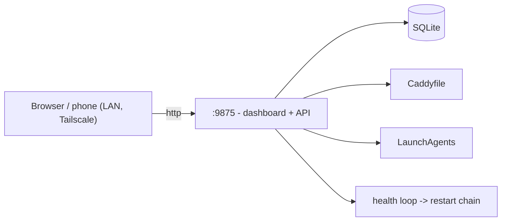

<div align="center">
  
  <h1>Local Apps</h1>
  <p><em>Self-healing dashboard for a fleet of local dev apps</em></p>
</div>

Register an app once and Local Apps assigns it a port, writes its Caddy reverse proxy and macOS LaunchAgent, health-checks it every 30 seconds, restarts it when it crashes, and exposes it by name over LAN and Tailscale. One page replaces the wall of `npm run dev` tabs. It runs 65 apps on a base M4 Mac Mini, with about 6 awake at any time and the rest parked at zero cost.


[](LICENSE)


## Features

- **One page** - live status for every app over SSE, with LAN, Tailscale, and production links and a QR code for your phone.
- **Zero-config onboarding** - `POST /api/apps` with an id; the port, the `<id>.localhost` proxy, and the LaunchAgent are provisioned for you.
- **Self-healing** - down apps walk a 5-level chain: kickstart, port-kill and reload, log-driven fixes, an optional local AI agent, and a circuit breaker that parks a flapping app instead of looping.
- **Multi-machine** - a hub runs the bots; agent machines only report status.
- **Fails closed off-box** - loopback is trusted, every other caller is denied mutations and log reads unless it sends `x-local-apps-token`.

## Quick start

```bash
git clone https://github.com/bunlongheng/local-apps.git
cd local-apps
npm install
npm run dev
```

Open http://localhost:9875. With no `apps.config.json` it seeds 2 demo apps from `apps.config.example.json`. Register your own:

```bash
curl -X POST http://localhost:9875/api/apps \
  -H "Content-Type: application/json" \
  -d '{"id":"hello-app","localPath":"/path/to/hello-app"}'
```

Caddy proxies and LaunchAgents are macOS features (Homebrew Caddy). Elsewhere the dashboard and API still run in monitoring mode.

## How it works

One Node 22 process on `node:http`, no framework and no build step: `server.js` serves the vanilla-JS dashboard in `public/` and owns the API, backed by SQLite.



| Level | After | Action |
|-------|-------|--------|
| L1 | detect | `launchctl` kickstart, bootstrap fallback |
| L2 | 90s | kill the port, full reload |
| L3 | 180s | read the log tail, `npm install`, clear stale build cache, restart |
| L4 | 300s | optional: hand the failure to a local Claude Code CLI agent |
| L5 | 3 flaps in 2 min | circuit breaker: park it OFF, re-arm when seen healthy |

## Configuration

No environment variables are required.

| Env var | Default | Purpose |
|---------|---------|---------|
| `MACHINE_ROLE` | `hub` | `hub` runs bots and auto-fix; `agent` reports status only |
| `CADDYFILE` | `/opt/homebrew/etc/Caddyfile` | Caddyfile the monitor edits |
| `API_BIND` | `0.0.0.0` | set `127.0.0.1` to keep the API off the LAN entirely |
| `LOCAL_APPS_TOKEN` | unset | shared secret that grants a trusted LAN or tailnet machine control |

## Project layout

```
server.js     API, SSE, provisioning, health and restart loop
db.js         SQLite data layer
public/       vanilla-JS dashboard
lib/          tested modules: http-app, validate, auth-gate, caddy, launchd, health, breaker
scripts/      onboarding, icons, consistency and storage checks
tests/        unit (node:test) and e2e (needs a running instance)
```

## Testing

```bash
npm run test:unit   # unit
npm test            # unit + e2e, e2e needs the app running on :9875
npm run lint
```

## License

[MIT](LICENSE) (c) Bunlong Heng
