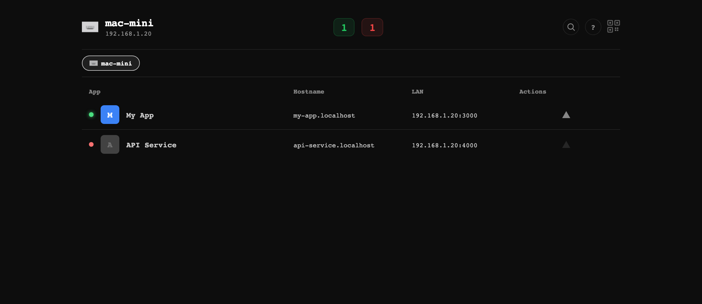
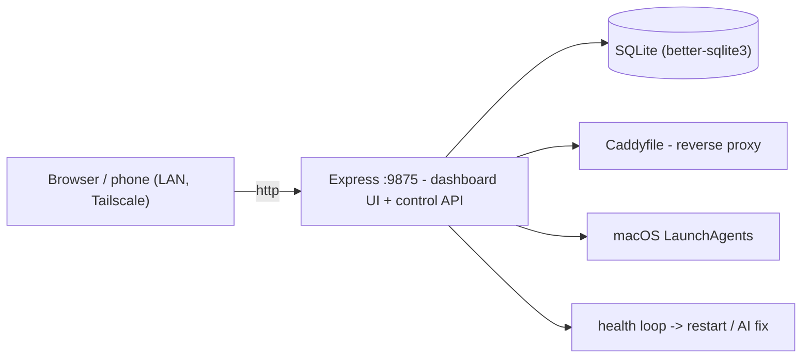

# Local Apps

A self-healing dashboard for a fleet of local dev apps. Register an app and it auto-assigns a port, wires a Caddy reverse proxy and a macOS LaunchAgent, then health-checks it, restarts it when it crashes, and exposes it over LAN and Tailscale - all from one page.



[](LICENSE)


## Contents

- [Features](#features)
- [Architecture](#architecture)
- [How a health check works](#how-a-health-check-works)
- [Tech stack](#tech-stack)
- [Quick start](#quick-start)
- [Configuration](#configuration)
- [Project layout](#project-layout)
- [Testing](#testing)
- [License](#license)

## Features

- **One-page dashboard** - live status for every app over SSE, with LAN, Tailscale, and Vercel links and a scannable QR for phone access.
- **Zero-config onboarding** - `POST /api/apps` with an id and it auto-assigns a free port, writes a Caddy reverse proxy at `<id>.localhost`, and creates a macOS LaunchAgent.
- **Self-healing** - a 30s async health loop marks apps up/down; a down app is restarted via `launchctl`, with a bootstrap fallback and cache-corruption recovery.
- **AI auto-fix (optional)** - when a restart does not stick, it can hand the failure to a Claude Code agent to diagnose and fix.
- **Multi-machine** - a hub runs the bots; agent machines report status only. Sync app lists across machines on the LAN.
- **API + Swagger** - a documented REST + SSE control API.

## Architecture

One Node.js service: an Express server (`server.js`) that serves the static vanilla-JS dashboard and owns the control API and all OS orchestration, backed by SQLite. There is no separate frontend and no build step - the browser loads `public/` and talks to the same-origin `/api/*` routes on `:9875`.



| Layer | Role |
|-------|------|
| `public/` (vanilla JS) | Dashboard - a same-origin client over the API |
| `server.js` (Express) | Control plane + static UI host: REST + SSE, provisioning, health loop |
| `db.js` (SQLite) | Data layer - apps, machines, profiles; fully parameterized |
| `lib/` | Focused, tested modules: `validate`, `caddy`, `launchd`, `health` |
| `scripts/` | Icon generation, onboarding, ops automations |

## How a health check works

```mermaid
sequenceDiagram
    participant Loop as Health loop (30s)
    participant H as lib/health
    participant App as Target app
    participant LD as launchctl
    Loop->>H: checkAll()
    H->>App: tcpCheck(healthUrl) or processCheck
    App-->>H: up / down
    alt was up, now down
        H->>LD: restart via LaunchAgent
        LD-->>H: started (bootstrap fallback if needed)
    end
    H-->>Loop: broadcast status over SSE
```

## Tech stack

- **Node.js + Express 4** - one service (`server.js`) that serves the dashboard UI and the REST + SSE control API on `:9875`
- **Vanilla JS** (`public/app.js`) - the dashboard is a same-origin client; no framework, no build step
- **better-sqlite3** - embedded, synchronous SQLite via `db.js`
- **Sharp** + **resvg** - app icon / favicon processing
- **Caddy** - per-app `*.localhost` reverse proxies (host tool)
- **Tailscale** - optional remote access (host tool)
- **node:test** + **ESLint** - unit/e2e tests and backend lint

## Quick start

```bash
git clone https://github.com/bunlongheng/local-apps.git
cd local-apps
npm install

# one service: dashboard UI + control API on :9875
npm run dev      # node --watch server.js (or `npm run start` for prod)
```

Open http://localhost:9875 (or http://local-apps.localhost via Caddy). On first run with no `apps.config.json`, it seeds a demo from `apps.config.example.json`.

Register an app:

```bash
curl -X POST http://localhost:9875/api/apps \
  -H "Content-Type: application/json" \
  -d '{"id":"my-app","localPath":"/Users/me/Sites/my-app"}'
```

> Caddy reverse proxies and macOS LaunchAgents are host-only features (macOS + Homebrew Caddy). A `Dockerfile` is included to run the dashboard + API in monitoring ("agent") mode elsewhere.

## Configuration

No environment variables are required. All are optional:

| Env var | Default | Purpose |
|---------|---------|---------|
| `MACHINE_ROLE` | `hub` | `hub` runs bots + auto-fix + nightly jobs; `agent` reports status only |
| `CADDYFILE` | `/opt/homebrew/etc/Caddyfile` | Caddyfile the monitor edits when provisioning proxies |
| `API_BIND` | `127.0.0.1` | Interface the control API binds to (keep localhost unless you run trusted peer sync) |

See `.env.example`. Role can also be set in `machine-role.json`.

## Project layout

```
server.js       Express control API + static UI host: REST + SSE, provisioning, health loop
db.js           SQLite data layer (better-sqlite3)
public/         Vanilla-JS dashboard (app.js), static assets, favicons
lib/
  validate.js   Input validation + escaping
  caddy.js      Caddyfile reverse-proxy management
  launchd.js    macOS LaunchAgent create/remove
  health.js     Health-check primitives (state, tcp/process check)
  api.ts        Shared API type definitions
launchctl-cmds.js, launchd-parse.js   launchctl helpers
scripts/        Icon generation, onboarding, ops automations
tests/          unit/ (helpers) + e2e/ (route guards)
docs/           Screenshots used by this README
Dockerfile      Dashboard + API in agent mode
```

## Testing

```bash
npm test          # unit + e2e (e2e needs a running instance on :9875)
npm run test:unit # unit only
npm run lint      # ESLint on the Node backend
```

## License

[MIT](LICENSE) (c) Bunlong Heng
