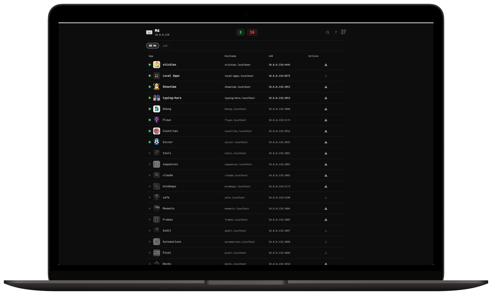

#  Local Apps

Self-healing dashboard for a fleet of local dev apps.

Register an app once. Local Apps assigns it a port, writes its Caddy reverse proxy and macOS LaunchAgent, health-checks it every 30 seconds, restarts it when it crashes, and exposes it by name over LAN and Tailscale. One page instead of a wall of `npm run dev` tabs. Apps you are not using stay parked at zero cost until you start them; the monitor itself is 1 Node process with 2 runtime dependencies.



[](LICENSE)


## Features

- **One page** - live status over SSE, with LAN, Tailscale, and production links, plus a QR code for your phone.
- **Zero-config onboarding** - `POST /api/apps` with an id; port, `<id>.localhost` proxy, and LaunchAgent are provisioned for you.
- **Self-healing** - a down app walks 5 levels: kickstart, port-kill and reload, log-driven fixes, an optional local AI agent, and a circuit breaker that parks a flapping app instead of looping.
- **Multi-machine** - a hub runs the bots; agent machines only report status.
- **Fails closed off-box** - loopback is trusted; any other caller is denied mutations and log reads unless it sends `x-local-apps-token`.

## Quick start

Node 22 or newer (`.nvmrc` is set; `nvm use` picks it up).

```bash
git clone https://github.com/bunlongheng/local-apps.git
cd local-apps
npm install
npm run dev
```

Open http://localhost:9875. With no `apps.config.json` it seeds 2 demo apps. Register your own:

```bash
curl -X POST http://localhost:9875/api/apps \
  -H "Content-Type: application/json" \
  -d '{"id":"hello-app","localPath":"/path/to/hello-app"}'
```

Caddy proxies and LaunchAgents are macOS features (Homebrew Caddy). Elsewhere the dashboard and API run in monitoring mode.

## How it works

One Node 22 process on `node:http`, no framework, no build step. `server.js` serves the vanilla-JS dashboard in `public/` and owns the API, backed by SQLite. When an app goes down:

| Level | After | Action |
|-------|-------|--------|
| L1 | detect | `launchctl` kickstart |
| L2 | 90s | kill the port, full reload |
| L3 | 180s | read the log, `npm install`, clear stale build cache, restart |
| L4 | 300s | optional: hand it to a local Claude Code CLI agent |
| L5 | 3 flaps in 2 min | circuit breaker: park it OFF, re-arm when healthy |

## Hub extras

On the `hub` role only, 5 routes serve the owner's own workflow rather than the product: `/api/tab-colors`, `/api/consistency`, `/api/app-profiles`, `/api/icon-sync`, `/api/capabilities`. They read optional local files and repos; on an `agent` machine they are not registered.

## API

The dashboard talks to these same-origin routes; peers read `/api/status` server-side. Off-box callers may read status but every mutation needs `x-local-apps-token`.

| Route | What |
|-------|------|
| `GET /api/status`, `GET /api/apps`, `GET /api/apps/:id` | registry with live status (paths stripped off-box) |
| `POST /api/apps`, `PUT /api/apps/:id`, `DELETE /api/apps/:id` | register, edit, remove (removal kills the process and unloads the agent) |
| `POST /api/start/:id`, `POST /api/stop/:id`, `POST /api/apps/:id/toggle`, `POST /api/apps/bulk-toggle` | lifecycle |
| `GET /api/log/:id` | last 30 lines of the app log |
| `GET /api/events` | SSE: `update`, `alert`, `reload` |
| `GET /api/machines`, `GET /api/machine`, `GET /api/machines/:id/apps`, `GET /api/machines/:id/status` | peers |
| `GET /api/qr`, `GET /api/manifest`, `GET /api/favicons` | dashboard support |

## Configuration

Self-healing is opt-in. Copy `data/auto-restart.example.json` to `data/auto-restart.json` (`{"enabled": true}`) to turn the L1-L5 chain on; add `"agent": true` to allow L4 to hand a failure to a local Claude Code CLI. Without the file the hub only monitors.

No environment variables are required.

| Env var | Default | Purpose |
|---------|---------|---------|
| `MACHINE_ROLE` | `hub` | `hub` runs bots and auto-fix; `agent` reports only |
| `CADDYFILE` | `/opt/homebrew/etc/Caddyfile` | Caddyfile the monitor edits |
| `LAUNCH_AGENTS_DIR` | `~/Library/LaunchAgents` | where per-app plists are written (a scratch dir for tests) |
| `PORT` | `9875` | listen port; only for a scratch instance (launchd and Caddy expect 9875) |
| `LOCAL_APPS_FAVICONS_DIR` | `public/favicons` | favicon directory served to the dashboard (a temp dir for tests) |
| `LOCAL_APPS_CONFIG` | `apps.config.json` (else the example) | seed file for an empty database |
| `LOCAL_APPS_NO_SWEEP` | unset | `1` stops a hub from probing the subnet (scratch instances) |
| `LOCAL_APPS_HOME` | `~` | home dir read for the tab registry and hub extras (a temp dir for tests) |
| `LOCAL_APPS_LOG_DIR` | `~/Library/Logs/local-apps` | where app logs are written (a temp dir for tests) |
| `API_BIND` | `0.0.0.0` | `127.0.0.1` keeps the API off the LAN |
| `LOCAL_APPS_TOKEN` | unset | grants a trusted LAN or tailnet machine control |
| `LOCAL_APPS_DB` | `./local.db` | SQLite file; tests point it at a temp file |
| `LOCAL_APPS_DEBUG` | unset | `1` logs the failures the restart chain tolerates |

Optional integration: if `~/.claude/tab-colors.json` exists, the dashboard reads tab colors from it and renaming an app writes the label back. No file, no effect.

## Layout and tests

```
server.js       wiring, health loop, provisioning; ctx for the routes
routes/         apps.js (registry, start/stop, events, log), meta.js (hub extras), machines.js (peers)
lib/            every module has a matching tests/unit/<name>.test.js (http-app, auth-gate, validate, chrome-ext, escalation, breaker, tick, chain, monitor, infra, peers, caddy, launchd, health, tab-colors)
db.js           SQLite data layer
public/         vanilla-JS dashboard, service worker, offline page
scripts/        generate-favicons, consistency, onboard-app.sh, storage-guard.sh (the owner's own tooling, kept for reference)
tests/          unit/ (every lib module, db, routes, the service worker and the dashboard under jsdom) and e2e/
                npm test (unit), npm run test:e2e (needs the app on :9875), npm run test:all, npm run lint
                npm run test:coverage gates the aggregate; npm run test:coverage:files floors every runtime file; npm run test:coverage:dashboard floors public/app.js
```

---

<div align="center">

<a href="https://bunlongheng.com"></a>
<a href="https://www.linkedin.com/in/bunlongheng/"></a>
<a href="https://www.instagram.com/ibunlong/"></a>
<a href="mailto:bheng.code@gmail.com"></a>

<br>

Built by **[Bunlong](https://bunlongheng.com)** &nbsp;&middot;&nbsp; [more apps](https://bunlongheng.com/projects)

</div>
