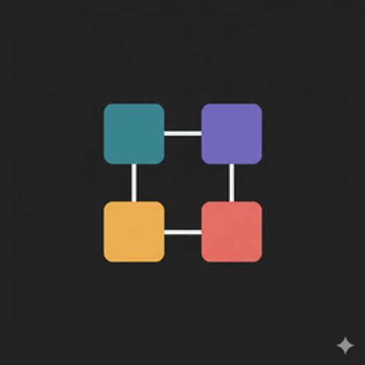
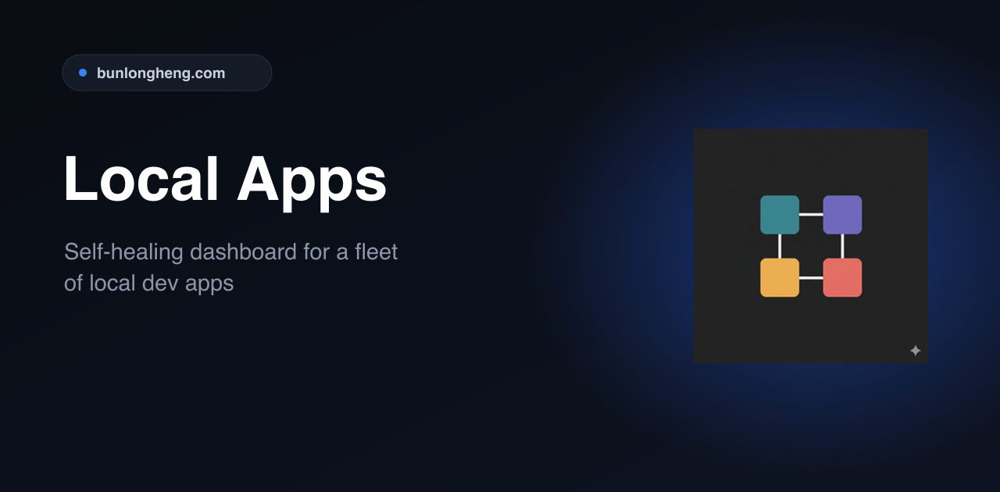
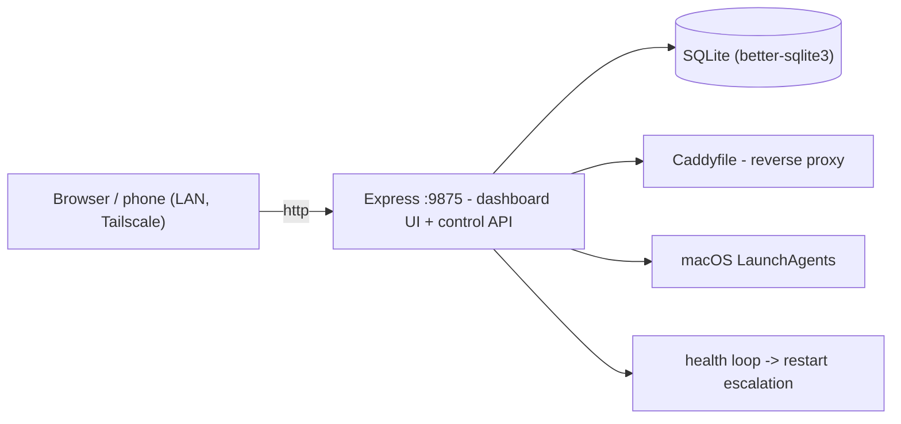
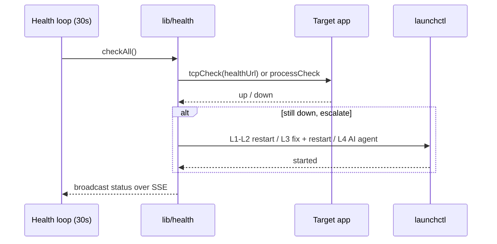

<div align="center">
  
  <h1>Local Apps</h1>
  <p><em>Self-healing dashboard for a fleet of local dev apps - monitors, restarts, and auto-fixes them</em></p>
  <p><a href="https://github.com/bunlongheng/local-apps">Repo</a> &middot; <a href="https://bunlongheng.com/projects?name=local-apps">Portfolio</a></p>
  
</div>

---

# Local Apps

A self-healing dashboard for a fleet of local dev apps. Register an app and it auto-assigns a port, wires a Caddy reverse proxy and a macOS LaunchAgent, then health-checks it, restarts it when it crashes, and exposes it over LAN and Tailscale - all from one page. No more wall of `npm run dev` terminal tabs.


[](LICENSE)


## Contents

- [Running in the wild](#running-in-the-wild)
- [Features](#features)
- [Architecture](#architecture)
- [How self-healing works](#how-self-healing-works)
- [Tech stack](#tech-stack)
- [Quick start](#quick-start)
- [Configuration](#configuration)
- [Security model](#security-model)
- [Project layout](#project-layout)
- [Testing](#testing)
- [License](#license)

## Running in the wild

This is not a toy. It runs a real fleet: **56 apps provisioned on a single base M4 Mac Mini**, each with its own port, a `*.localhost` Caddy proxy, and a macOS LaunchAgent - wired automatically the moment the app is registered. At any given time only the few I am actively working on stay awake. A typical day sits around 6 running and 50 parked, so the machine stays cool and idle apps cost nothing until I open one.

The real win is what it removes. No wall of terminal windows, no `npm run dev` to babysit per project, no "which port was that on again". One page starts what I need and cleans up what I do not, so I can stay focused on building instead of tracking 50 dev servers in my head. Register an app once and it is reachable by name over LAN and Tailscale from then on. 56 apps, one small Mac Mini, and the cognitive overhead of running them drops to a single dashboard and a green dot.

## Features

- **One-page dashboard** - live status for every app over SSE, with LAN, Tailscale, and Vercel links and a scannable QR for phone access.
- **Zero-config onboarding** - `POST /api/apps` with an id and it auto-assigns a free port, writes a Caddy reverse proxy at `<id>.localhost`, and creates a macOS LaunchAgent.
- **Self-healing** - a 30s health loop marks apps up/down and walks a 4-level restart escalation (kickstart -> port-kill + reload -> log-driven fixes -> optional AI agent).
- **AI auto-fix (optional)** - as the last escalation level, when deterministic restarts do not stick it can hand the failure to a local Claude Code CLI agent to diagnose and fix. Off by default; gated by `data/auto-restart.json` and the hub role.
- **Multi-machine** - a hub runs the bots; agent machines report status only. Sync app lists across machines on the LAN.
- **REST + SSE control API** - ~30 documented routes for apps, machines, status, logs, and events.

## Architecture

One Node.js service: an Express server (`server.js`) that serves the static vanilla-JS dashboard and owns the control API and all OS orchestration, backed by SQLite. There is no separate frontend and no build step - the browser loads `public/` and talks to the same-origin `/api/*` routes on `:9875`.



| Layer | Role |
|-------|------|
| `public/` (vanilla JS) | Dashboard - a same-origin client over the API |
| `server.js` (Express) | Control plane + static UI host: REST + SSE, provisioning, health loop |
| `db.js` (SQLite) | Data layer - apps, machines, profiles; fully parameterized |
| `lib/` | Focused, tested modules: `validate`, `auth-gate`, `caddy`, `launchd`, `health` |
| `scripts/` | Icon generation, onboarding, consistency + storage checks |

## How self-healing works

Every 30s the health loop checks each app and, when one is down, walks an escalation chain - each level only fires if the app is still down after the previous one:

| Level | After | Action |
|-------|-------|--------|
| L1 | detect | Kickstart via `launchctl` (bootstrap fallback if the agent was booted out) |
| L2 | 90s | Kill the port, full `bootout` + `bootstrap` reload |
| L3 | 180s | Read the log tail, apply common fixes (`npm install`, clear stale build cache, free the port), restart |
| L4 | 300s | Optional: hand the failure to a local Claude Code CLI agent to diagnose and fix (last resort) |



Counters reset the moment an app comes back up.

## Tech stack

- **Node.js + Express 4** - one service (`server.js`) that serves the dashboard UI and the REST + SSE control API on `:9875`
- **compression** - gzip on API + UI responses
- **Vanilla JS** (`public/app.js`) - the dashboard is a same-origin client; no framework, no build step
- **better-sqlite3** - embedded, synchronous SQLite via `db.js`
- **Sharp** + **resvg** - app icon / favicon processing
- **qrcode** - generates the phone-access QR shown in the dashboard
- **Caddy** - per-app `*.localhost` reverse proxies (host tool)
- **Tailscale** - optional remote access (host tool)
- **node:test** + **ESLint** - unit/e2e tests and backend lint

## Quick start

```bash
git clone https://github.com/bunlongheng/local-apps.git
cd local-apps
npm install

# one service: dashboard UI + control API on :9875
npm run dev      # node --watch server.js (or `npm run start` for prod)
```

Open http://localhost:9875 (or http://local-apps.localhost via Caddy). On first run with no `apps.config.json`, it seeds a demo from `apps.config.example.json`.

Register an app:

```bash
curl -X POST http://localhost:9875/api/apps \
  -H "Content-Type: application/json" \
  -d '{"id":"my-app","localPath":"/path/to/my-app"}'
```

> Caddy reverse proxies and macOS LaunchAgents are host-only features (macOS + Homebrew Caddy). On other platforms the dashboard + API still run in monitoring ("agent") mode.

## Configuration

No environment variables are required. All are optional (see `.env.example`):

| Env var | Default | Purpose |
|---------|---------|---------|
| `MACHINE_ROLE` | `hub` | `hub` runs bots + auto-fix + nightly jobs; `agent` reports status only |
| `CADDYFILE` | `/opt/homebrew/etc/Caddyfile` | Caddyfile the monitor edits when provisioning proxies |
| `API_BIND` | `127.0.0.1` | Interface the control API binds to (keep localhost unless you run trusted peer sync) |
| `LOCAL_APPS_TOKEN` | unset | Shared secret to grant a trusted LAN/tailnet machine control (see below) |

Role can also be set in `machine-role.json`.

## Security model

The control API **fails closed off-box**. Loopback callers (the localhost dashboard, directly or via the Caddy loopback proxy) are fully trusted. Any non-localhost caller may read only non-sensitive status GETs; every mutating request (POST/PUT/DELETE) and every sensitive read (logs) is **denied** unless it presents a matching `x-local-apps-token` header. This closes unauthenticated LAN command-injection and secret reads even in the default, no-token setup. Set `LOCAL_APPS_TOKEN` only to grant a trusted LAN/tailnet machine control. The policy is a pure, unit-tested function in `lib/auth-gate.js`.

## Project layout

```
server.js       Express control API + static UI host: REST + SSE, provisioning, health/restart loop
db.js           SQLite data layer (better-sqlite3)
public/         Vanilla-JS dashboard (app.js, app.css, index.html), icons, manifest
lib/
  validate.js   Input validation + shell-safety escaping
  auth-gate.js  Trust-loopback auth policy (fail-closed off-box, token-gated)
  caddy.js      Caddyfile reverse-proxy management
  launchd.js    macOS LaunchAgent create/remove
  health.js     Health-check primitives (state, tcp/process check)
launchctl-cmds.js, launchd-parse.js   launchctl command builders + plist parsing
scripts/
  consistency.js        Per-app artifact-matrix checker (/api/consistency)
  generate-favicons.js  Icon / favicon generation (npm run icons)
  onboard-app.sh        New-app onboarding helper
  storage-guard.sh      Disk-usage guard
tests/          unit/ (helpers, pure logic) + e2e/ (route guards)
docs/           Icon, social preview, dashboard screenshot
start.sh        launchd entrypoint (exec node server.js)
```

## Testing

```bash
npm test          # unit + e2e (e2e needs a running instance on :9875)
npm run test:unit # unit only
npm run lint      # ESLint on the Node backend
```

## License

[MIT](LICENSE) (c) Bunlong Heng

---

<p align="center">
  <sub>Built by <a href="https://bunlongheng.com">Bunlong Heng</a> &middot; <a href="https://bunlongheng.com/projects/local-apps">See it in my portfolio &rarr;</a></sub>
</p>
